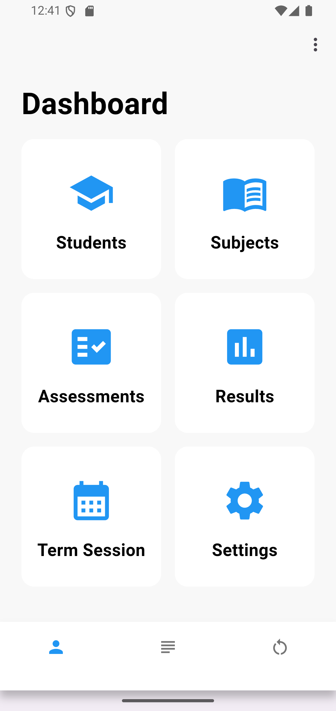
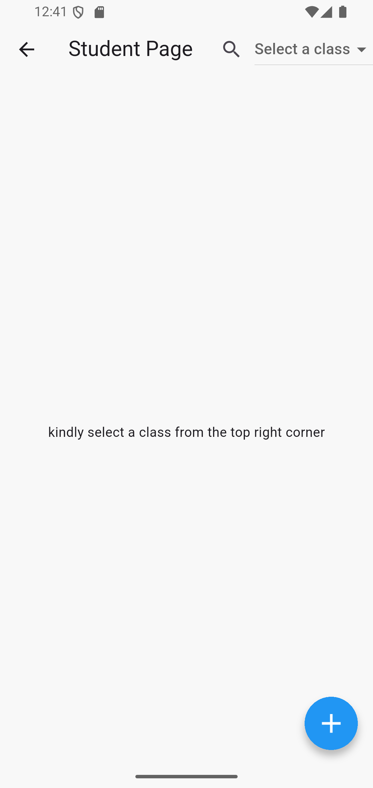
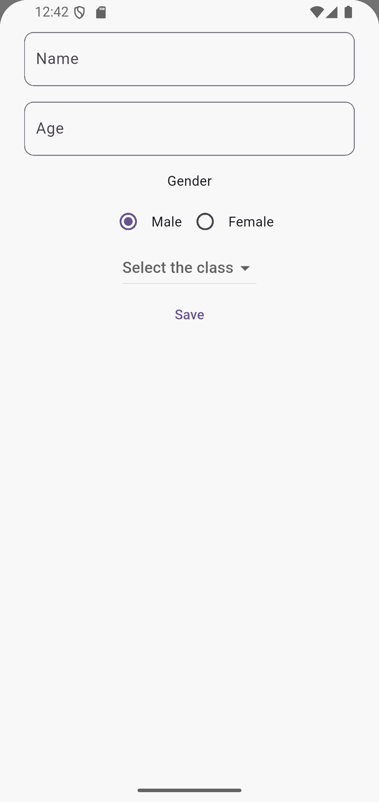
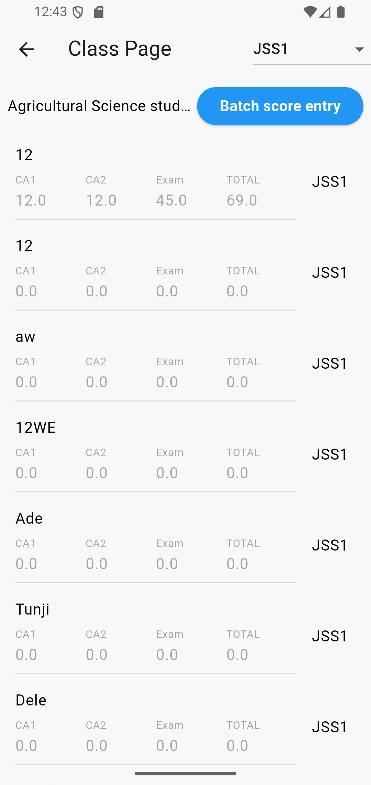
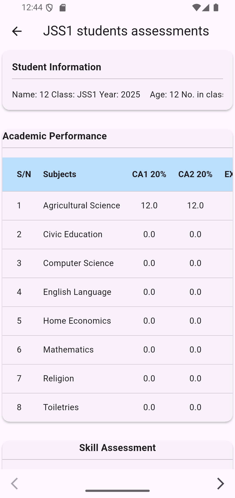
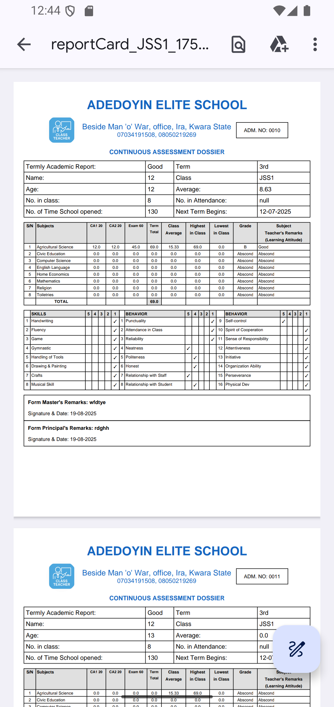
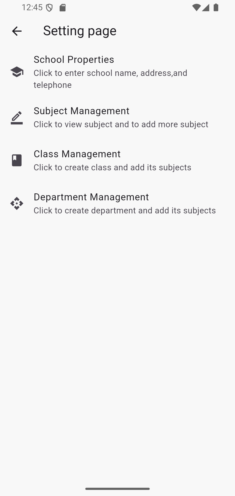

# 📘 ClassTeacher App

ClassTeacher is a school management app developed with **Flutter**.  
It streamlines record-keeping, automates academic report card generation, and makes it easier for schools to manage student data efficiently.

---

## ✨ Features
- 📋 Student registration & record management  
- 📝 Automated academic report card processing  
- ⚡ Local storage with **Hive** (lightweight NoSQL database)  
- 💾 Persistent storage with **Sqflite** (SQLite database for structured data)  
- 🎨 Clean, user-friendly Flutter UI  

---

## 🛠️ Tech Stack
- **Framework:** Flutter  
- **Databases:** Hive & Sqflite  
- **Language:** Dart  

---

## 📸 Screenshots

  








---

## 🎥 Demo GIF

- **GIF Example:**


---

## 🚀 Getting Started

```bash
# Clone the repo
git clone https://github.com/BashLaw-Cyber/ClassTeacher.git

# Navigate to project folder
cd classreportsheet

# Install dependencies
flutter pub get

# Run the app
flutter run

---

## 🧑‍💻 Developer

**Abdulsalam Olarinoye Bashir**  
[LinkedIn](https://www.linkedin.com/in/bashir-abdulsalam-gmnse-aa2b18246/) | [GitHub](https://github.com/BashLaw-Cyber)  
*Software Engineer & Educator*

---

## 🙌 Acknowledgments

- [Flutter](https://flutter.dev) & [Dart](https://dart.dev) community for amazing support and documentation  
- [Hive](https://docs.hivedb.dev/) and [Sqflite](https://pub.dev/packages/sqflite) package maintainers  
- Inspiration from teachers and schools still relying on manual record-keeping  

